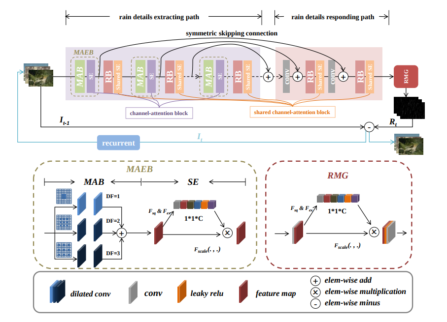
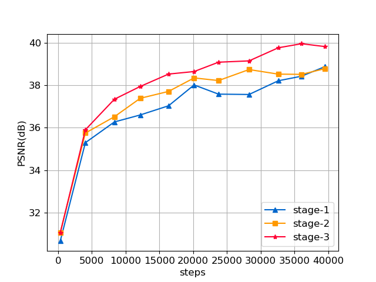
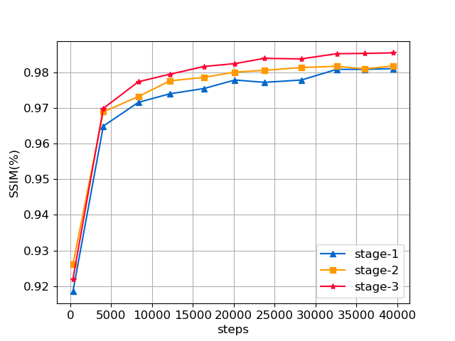
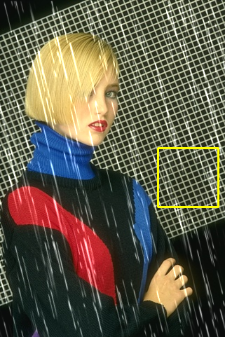
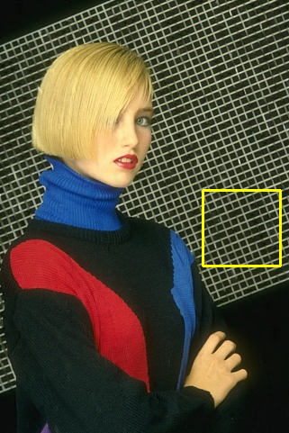

# Single Image Deraining using a Recurrent Multi-scale Aggregation and Enhancement Network (ICME'19)
   Youzhao Yang, [Hong Lu](http://homepage.fudan.edu.cn/honglu/en); School of Computer Science, Fudan University

# Abstract
   Single image deraining is an ill-posed inverse problem due to the presence of non-uniform rain shapes, directions, and densities in images. In this paper, we propose a novel progressive single image deraining method named Recurrent Multiscale Aggregation and Enhancement Network (ReMAEN). Differing from previous methods, ReMAEN contains a symmetric structure where recurrent blocks with shared channel attention are applied to select useful information collaboratively and remove rain streaks stage by stage. In ReMAEN, a Multi-scale Aggregation and Enhancement Block (MAEB) is constructed to detect multi-scale rain details. Moreover, to better leverage the rain details from rainy images, ReMAEN enables a symmetric skipping connection from low level to high level. Extensive experiments on synthetic and real-world datasets demonstrate that our method outperforms the state-of-the-art methods tremendously. Furthermore, ablation studies are conducted to show the improvements obtained by each module in ReMAEN.

<p align='center'></p>

# Citation
**If you find the resource useful, please cite the following:**
```
   @inproceedings{yang2019single,
      title={Single Image Deraining using a Recurrent Multi-scale Aggregation and Enhancement Network},
      author={Yang, Youzhao and Lu, Hong},   
      booktitle={IEEE International Conference on Multimedia and Expo (ICME)},
      year={2019}
   }
```

# Dataset
## Synthetic Datasets
   | Datasets | #train | #test | label |
   | :------- | -----: | ----: | :-----: |
   | [Rain100L]() | 200    | 100   | rain mask & rain map|
   | [Rain100H]() | 1800   | 100   | rain mask & rain map|
   | [Rain800]()  | 700    | 100   | -     |
   | [Rain1200]() | 12000  | 1200  | rain density |
   | [Rain1400]() | 12600  | 1400  | - |
   
## Real-World Datasets
   | Datasets | #train | #test | label |
   | :------- | :-----: | ----: | :-----: |
   | [Real-World]() | - | 146 | - |

# Requirements
   - python 3.6.5
   - opencv 3.4.2
   - numpy 1.14.3
   - argparse 1.1
   - tensorflow_gpu >=1.4.0 & < 2.0

# Usages
   - **Clone this repo**
   ```
      $ git clone https://github.com/nnUyi/ReMAEN
      $ cd ReMAEN
   ```
   
   - **Test**
   ```
      $ CUDA_VISIBLE_DEVICES=0 python main.py --is_testing True
                                              --train_dataset Rain100L
                                              --test_dataset Rain100L
                                              --trainset_size 200
                                              --testset_size 100
                                              --batch_size 32
   ```
   
   - **Train**
   ```
      $ CUDA_VISIBLE_DEVICES=0 python main.py --is_training True
                                              --train_dataset Rain100L
                                              --test_dataset Rain100L
                                              --trainset_size 200
                                              --testset_size 100
                                              --iterations 40000
                                              --lr 0.001
                                              --batch_size 32
   ```
   - **Where should your datasets place?**
      - In the ***32rd and 33rd lines of settings.py***, you can see the --data_path and --test_path settings. You should download the datasets (or putting your own dataset) in the target path.

# Results
   - **Recurrent rain removal analysis**
      <div align="center">
         
         
      </div>
      
   - **Edge loss analysis**
      <div align="center">
         
         
         
         
      </div>
   - Average PSNR and SSIM values on five synthetic datasets. 

# Acknowledgement
   - This work was supported in part by National Natural Science Foundation of China (No. U1509206).
